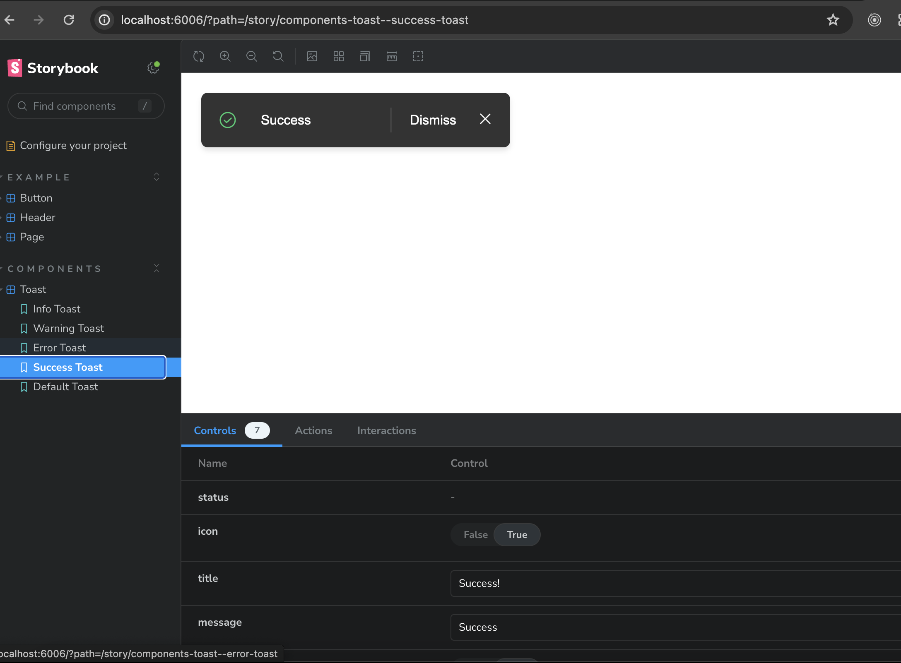

### Steps to run

### Use node v18

```
git clone https://github.com/nitishsaini706/react-toast-storybook.git

cd react-roast-storybook

npm install 

npm run storybook

```

### These steps will run storybook in your local

### Screenshots


